# PayswapHub — Role-wise & Flow-wise Guide

**Audience:** product, ops, compliance, and engineering  
**Scope after deep-clean:** merchant onboarding → KYC/KYB → agreement → purchase-order create/approve  
**Out of scope:** payments verification, voucher fulfilment, rewards, support tickets  

Local demo users (password `CorrectHorse9!`):

| Email | Portal | Role |
|-------|--------|------|
| `merchant@payswap.local` | `/merchant/` | Merchant |
| `kyc@payswap.local` | `/employee/` | KYC reviewer |
| `ops@payswap.local` | `/employee/` | Operations (PO review) |
| `admin@payswap.local` | `/administration/` | Platform admin |

Screenshots were captured from a seeded demo journey (`PSM-000001`, `AGR-000001`, `ORD-000001`) and live under [`screenshots/`](screenshots/).

---

## 1. End-to-end product flow

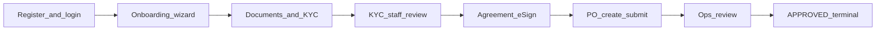
```mermaid
flowchart LR
  register[Register_and_login] --> onboard[Onboarding_wizard]
  onboard --> docs[Documents_and_KYC]
  docs --> staffKyc[KYC_staff_review]
  staffKyc --> agreement[Agreement_eSign]
  agreement --> poCreate[PO_create_submit]
  poCreate --> opsReview[Ops_review]
  opsReview --> approved[APPROVED_terminal]
```

| Stage | Who acts | Portal | Outcome |
|-------|----------|--------|---------|
| Register / login | Merchant | Auth | Account created, verified email/mobile |
| Onboarding wizard | Merchant | Merchant | Business, people, bank, documents, review |
| Advanced KYC | Merchant + Cashfree | Merchant Verification | PAN/GSTIN/bank/DigiLocker checks |
| Document review | KYC employee / admin | Employee / Admin | Docs approved or rejected |
| Application approve | KYC employee | Employee queue | Merchant active for agreements |
| Agreement | Merchant + admin/eSign | Merchant Agreements | Executed agreement → commercial active |
| Purchase order | Merchant | Merchant Orders | Draft → submitted |
| PO review | Operations employee | Employee Orders | Approve / reject / request changes |
| Terminal | — | — | **APPROVED** (no payment/fulfilment in this product) |

---

## 2. Roles & permissions (RBAC)

Permissions are defined in `access/seeds.py` and enforced by `access/policy.py`.

| Role slug | Portal | What they can do |
|-----------|--------|------------------|
| `merchant` | Merchant | Create/cancel/amend own POs; complete onboarding; upload docs; sign agreements |
| `kyc` | Employee | View merchants; review applications; approve KYC/KYB |
| `operations` | Employee | Review/approve/reject/request-changes/amend/cancel orders |
| `compliance` | Employee | View merchants; review (no KYC approve by default) |
| `support` | Employee | View merchants (queue visibility for clarifications) |
| `platform_admin` | Administration | Merchants, verification, onboarding, orders, employees, roles, audit, security |

Staff holding `kyc` or `operations` must enrol authenticator MFA (`STAFF_REQUIRE_OTP_ROLES`). Platform admins follow `ADMIN_REQUIRE_OTP` (mandatory in staging/production).

---

## 3. Shared auth surfaces

### 3.1 Login

Unified login at `/login/` for all portals. After success, users are routed to their portal home.

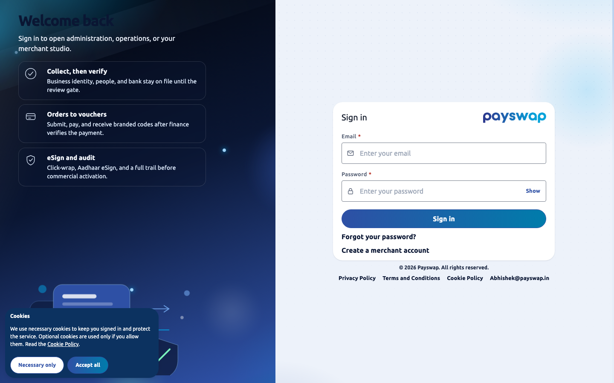

**Detail**

- Identifier is **email** + password.
- Rate limiting and lockout apply (5 failures / 10 minutes → 15-minute lock).
- Staff roles may be redirected to MFA setup/challenge before the portal loads.

### 3.2 Merchant registration

`/merchant/register/` walks a multi-step wizard: profile → email OTP → mobile OTP → password → terms.

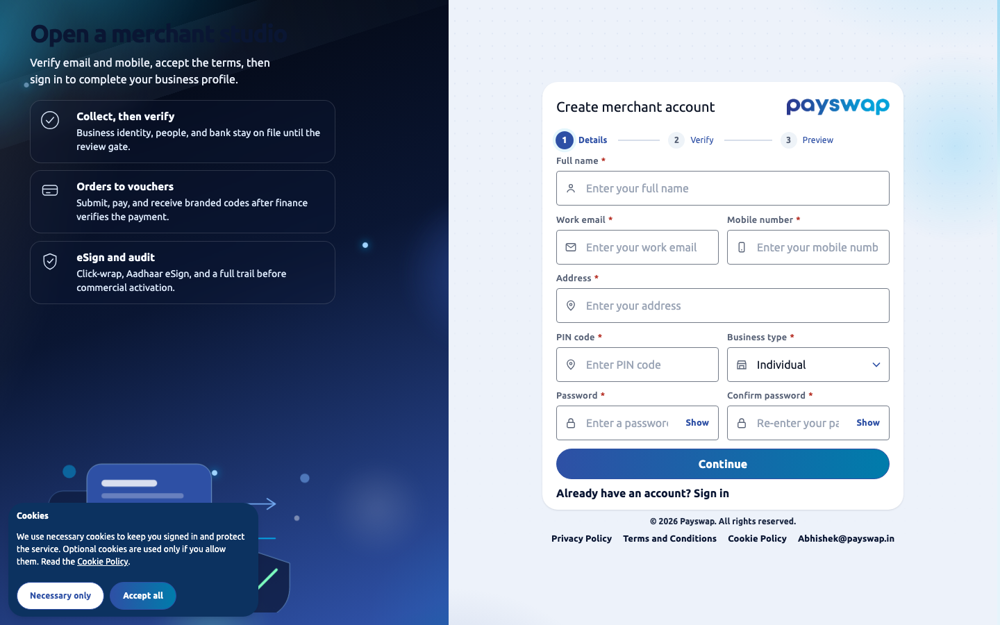

---

## 4. Flow A — Merchant onboarding

### Goal

Collect legal identity, ownership, bank, and documents so KYC staff can approve the application.

### Merchant screens

**Dashboard** — progress of the five wizard sections, open/approved order KPIs, shortcuts.

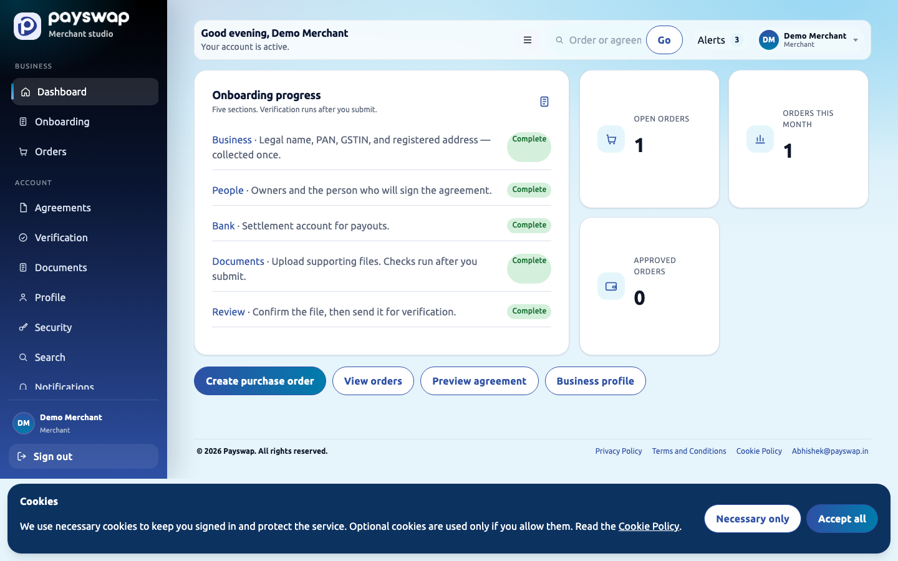

**Onboarding** — start or resume the wizard (`/merchant/onboarding/`).

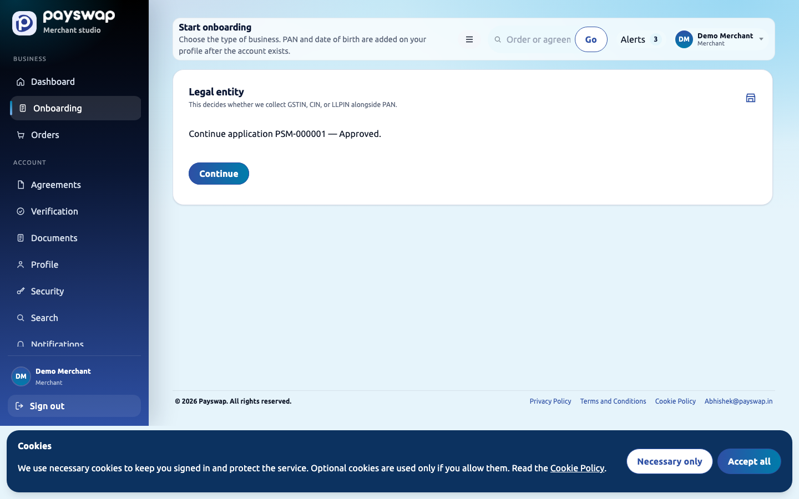

Wizard phases (in order):

1. **Business** — legal name, PAN, GSTIN/CIN as applicable, registered address / PIN (India Post autofill).
2. **People** — owners / authorized signatory and DOB.
3. **Bank** — account holder, account number (encrypted at rest), IFSC.
4. **Documents** — PAN and other proofs; uploads create `verification.Document` rows.
5. **Review** — accuracy confirmation, then **submit**.

Sensitive fields (PAN/GSTIN/CIN/LLPIN, owner PAN, bank account) are encrypted; UI shows masked values except where an executed agreement needs full disclosure.

### What happens on submit

- Application status → `SUBMITTED`.
- Merchant appears on employee **My queue** and admin **Onboarding**.
- Email notice `application` / clarification templates may fire on later decisions.

---

## 5. Flow B — KYC / KYB (advanced)

### Goal

Prove identity and business with documents **and** Cashfree Verification Suite (PAN, GSTIN, bank, DigiLocker Aadhaar), then staff-approve the file.

### Merchant — Verification center

`/merchant/verification/` shows collected identifiers and provider check status. Actions include verify collected data and DigiLocker Aadhaar (feature-flagged).

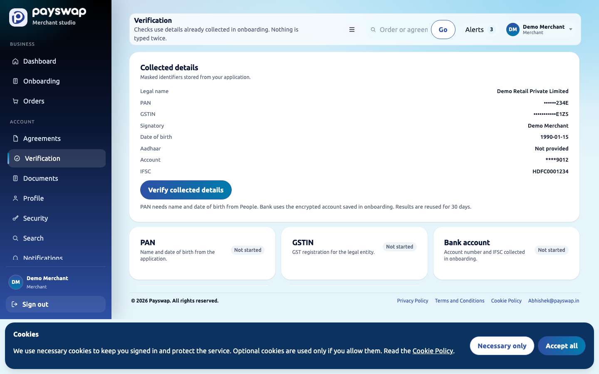

### Merchant — Documents

`/merchant/documents/` lists uploads, versions, and review status (`UPLOADED` → `VERIFIED` / `REJECTED` / `ACTION_REQUIRED`).

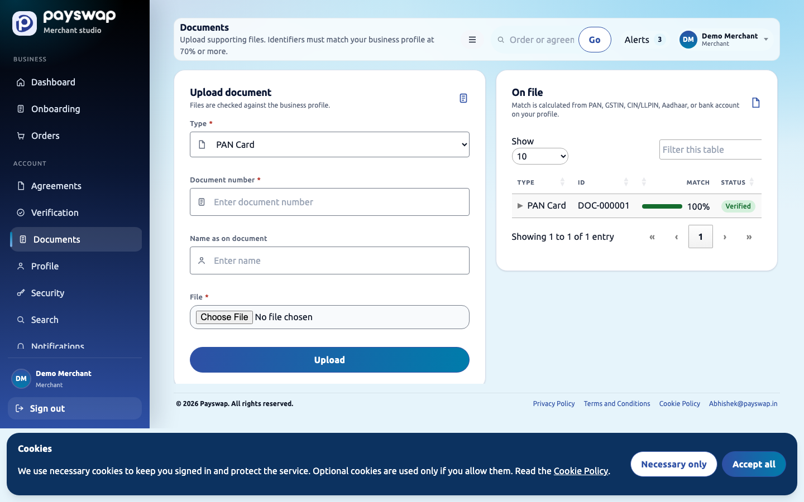

### KYC employee — desk & queue

Dashboard tiles: KYC reviews, KYB reviews, clarifications.

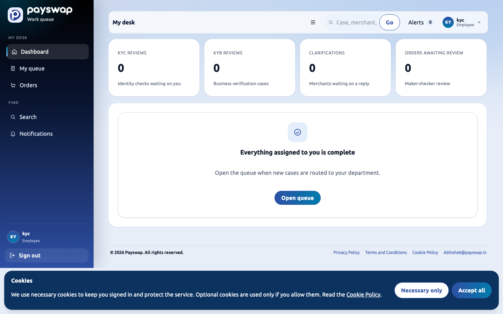

Queue lists applications awaiting review.

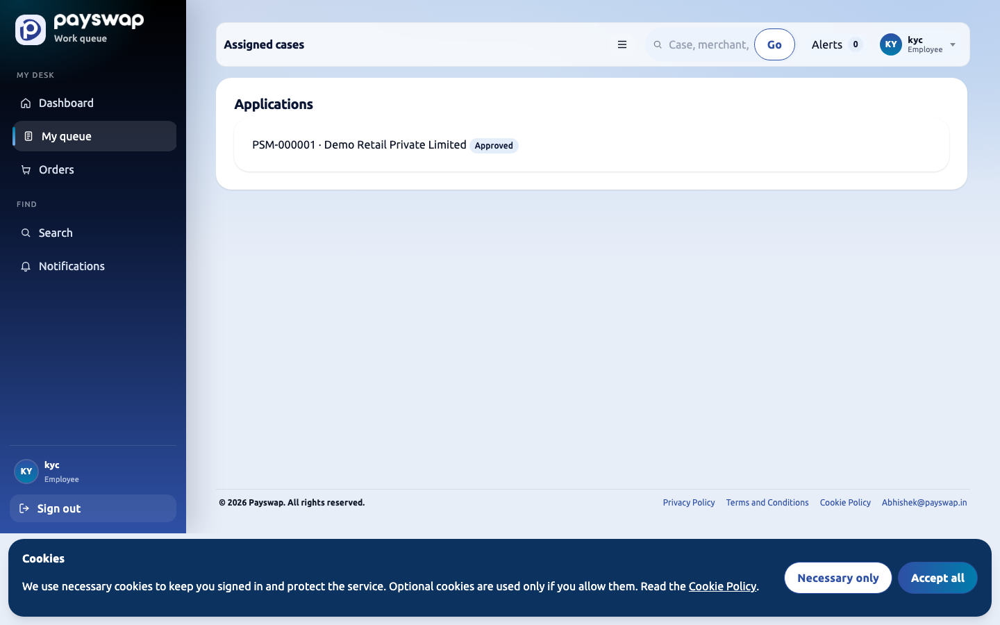

**KYC employee actions on an application**

| Action | Effect |
|--------|--------|
| Start review | `SUBMITTED` → `UNDER_REVIEW` |
| Approve | Application approved; agreement generation may start; merchant moves toward commercial readiness |
| Reject | Terminal reject with reason (emailed) |
| Clarification | Returns step to merchant with message |

### Admin — verification oversight

Cross-merchant Cashfree / DigiLocker records and document review.

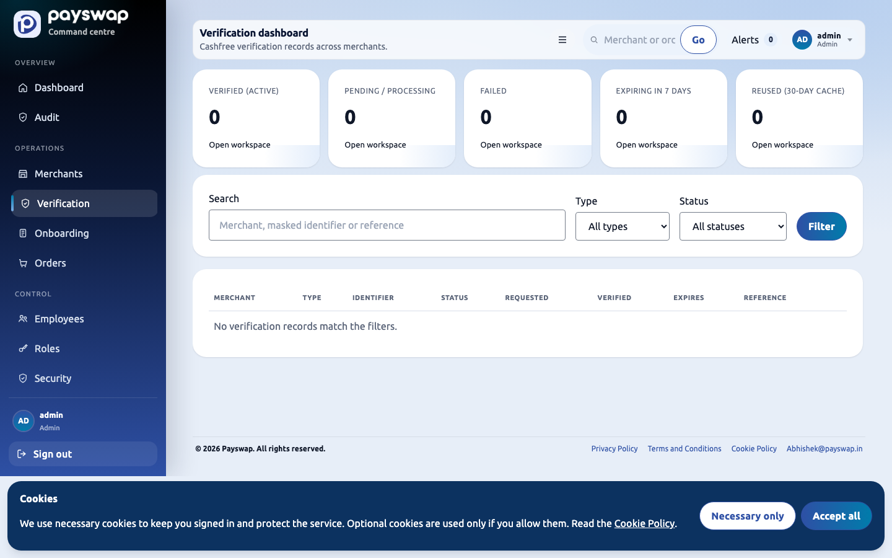

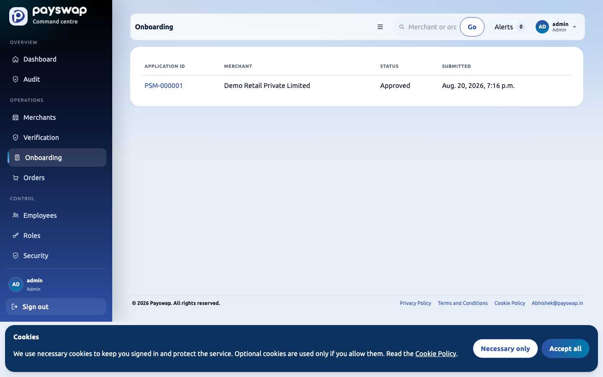

**Cashfree note:** Verification and eSign stay in product. Payment webhooks are ignored after the deep-clean.

---

## 6. Flow C — Agreement

### Goal

Generate the commercial agreement, have the merchant sign (Aadhaar eSign when enabled), countersign, and mark the merchant **commercially active**.

### Merchant — Agreements

`/merchant/agreements/` shows status (`GENERATED` → `MERCHANT_REVIEW` → `MERCHANT_SIGNED` → `COUNTERSIGNED` → `EXECUTED`) and download of the PDF.

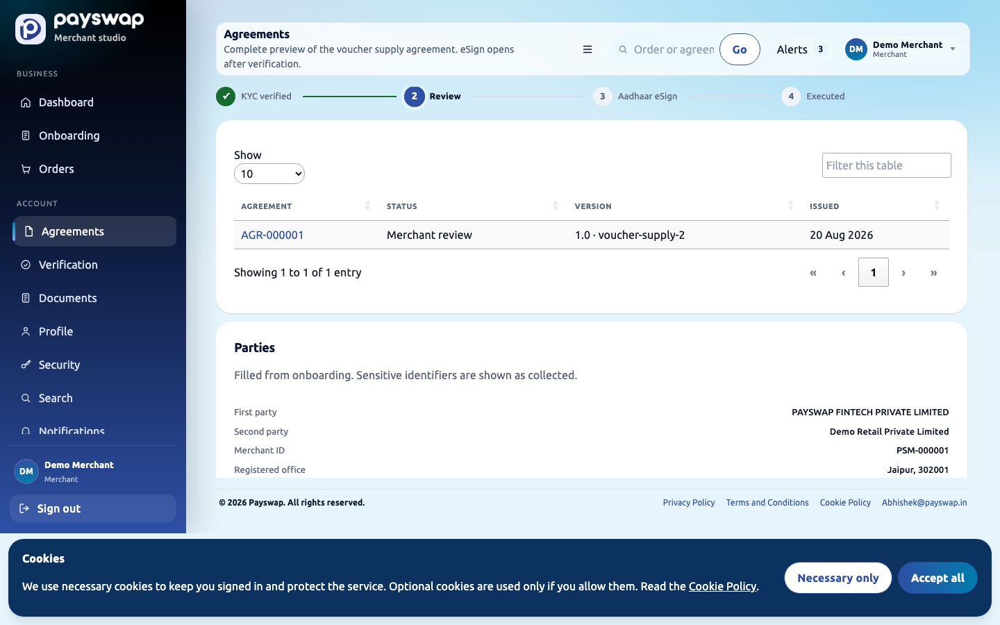

**Detail**

- Body is rendered from `agreements/template.py` (voucher supply commercial terms).
- eSign uses Cashfree Secure ID; browser return alone is never trusted — webhook / status poll confirms signature.
- Click-wrap may be blocked when eSign + KYC policy requires Aadhaar eSign.
- On execute: `merchant.agreement_status = VERIFIED` and commercial activation unlocks PO creation.

PO gate (enforced in `PaymentOrderService.create`):

- `commercial_status == ACTIVE`
- `agreement_status == VERIFIED`

---

## 7. Flow D — Purchase order (create → approve)

### Goal

Merchant creates a catalog-backed PO; operations reviews it; lifecycle **ends at APPROVED**.

### States

`DRAFT` → `SUBMITTED` → `UNDER_REVIEW` → **`APPROVED`**  
Also: `CHANGES_REQUESTED`, `REJECTED`, `CANCELLED`.

Amend from `APPROVED` creates a new revision and returns the order to `UNDER_REVIEW`.

### Merchant — orders

List, create wizard, and detail with stepper ending at Approved.

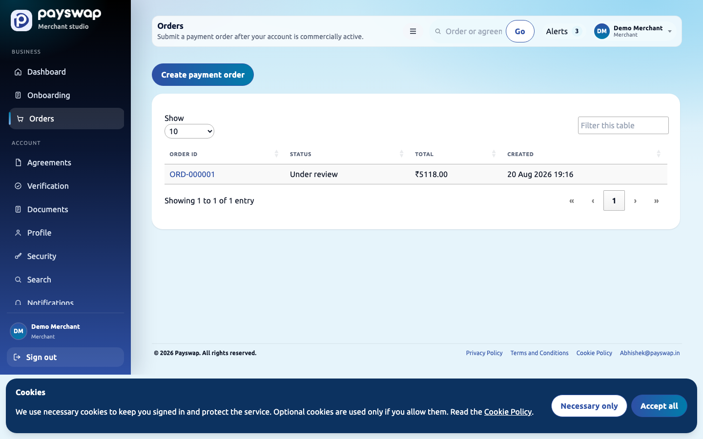

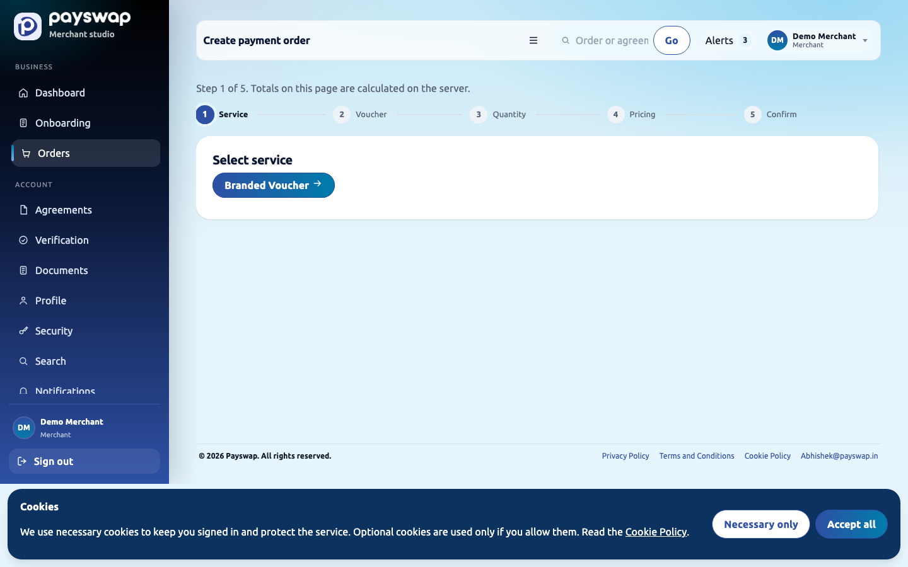

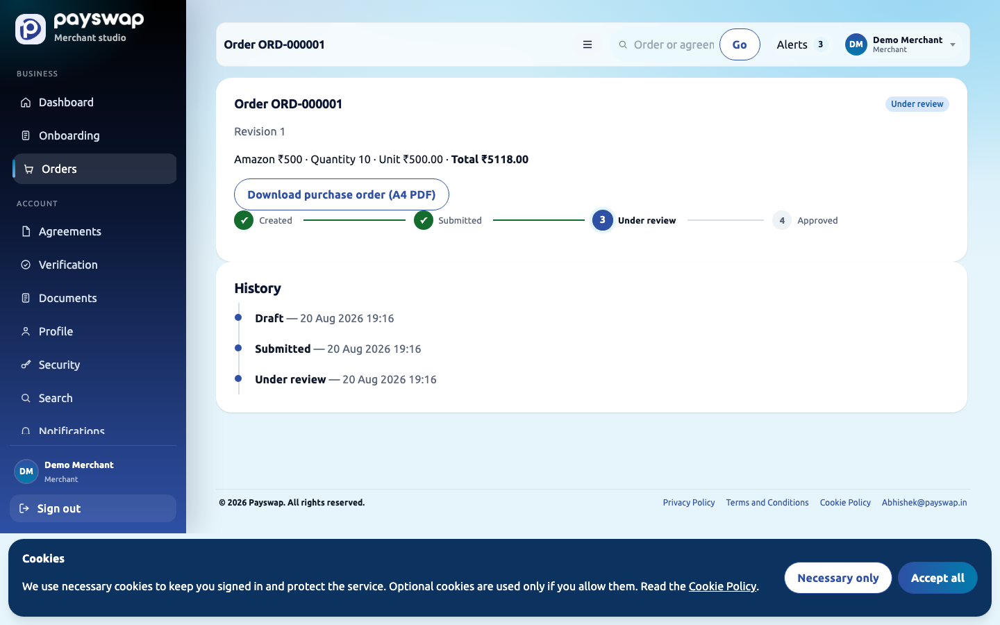

**Create steps (typical)**

1. Choose brand / product from active catalog (`BRANDED_VOUCHER`).
2. Enter quantity; server quotes unit, fees, tax, total (`OrderPricingService`).
3. Submit → staff queue.

Merchant can edit while `DRAFT` / `CHANGES_REQUESTED`, cancel while allowed, and download the A4 PO PDF (POST + audit).

### Operations — review

Ops dashboard and order list; detail shows approve / reject / request changes / amend and history.

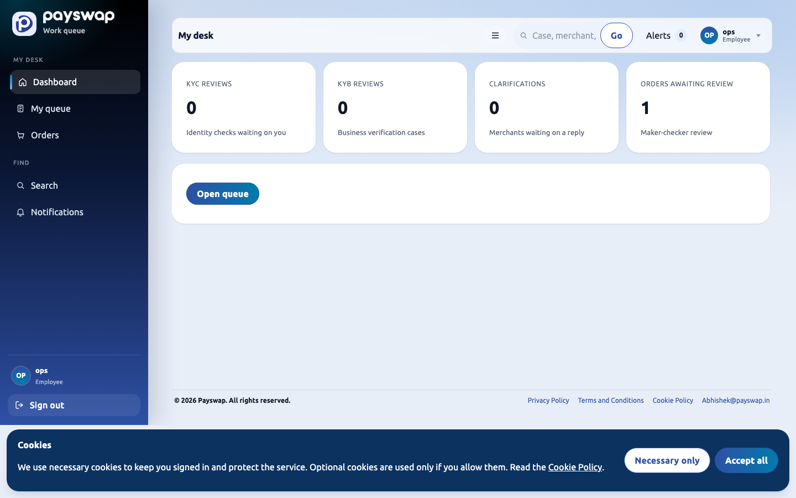

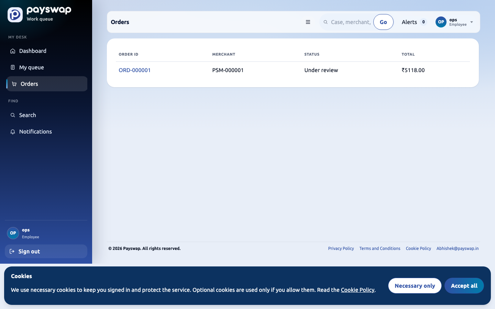

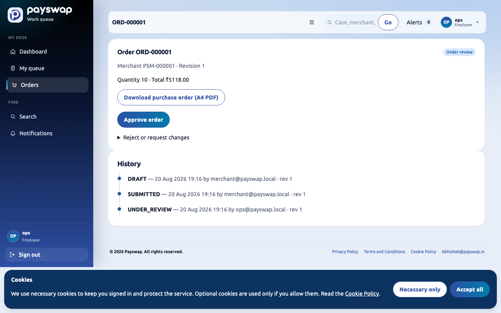

**Maker-checker:** the user who submitted the order cannot approve it (`Policy._order_approve`).

**Terminal meaning of APPROVED:** commercial acceptance of the PO. Settlement and delivery are outside this product slice.

---

## 8. Role deep-dives

### 8.1 Merchant

| Area | Path | Purpose |
|------|------|---------|
| Dashboard | `/merchant/` | Progress + order KPIs |
| Onboarding | `/merchant/onboarding/` | Wizard |
| Verification | `/merchant/verification/` | Provider KYC |
| Documents | `/merchant/documents/` | Uploads |
| Agreements | `/merchant/agreements/` | Sign / download |
| Orders | `/merchant/orders/` | PO lifecycle |
| Profile / security | `/merchant/profile/`, `/merchant/account/security/` | Contact prefs, MFA, sessions |

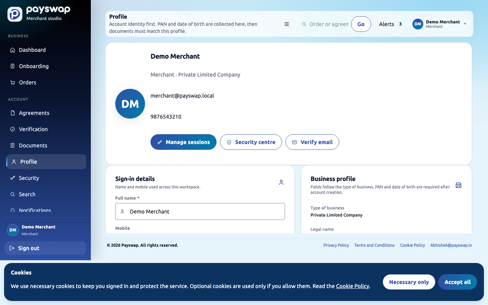

### 8.2 KYC employee

| Area | Path | Purpose |
|------|------|---------|
| Desk | `/employee/` | Queue counts |
| Queue | `/employee/queue/` | Applications |
| Application | `/employee/queue/<id>/` | Approve / reject / clarify |

Does **not** approve POs unless also granted operations permissions.

### 8.3 Operations employee

| Area | Path | Purpose |
|------|------|---------|
| Desk | `/employee/` | Orders awaiting review |
| Orders | `/employee/orders/` | List |
| Order | `/employee/orders/<id>/` | Review decisions + PO PDF |

### 8.4 Platform admin

Command centre for oversight and control — not a substitute for day-to-day KYC/ops queues, but can see everything.

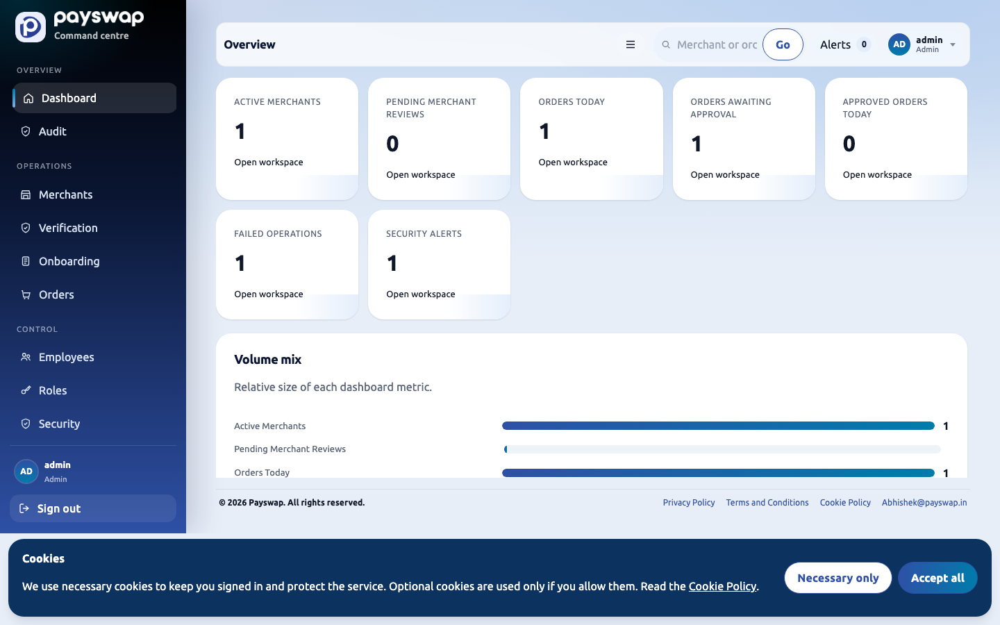

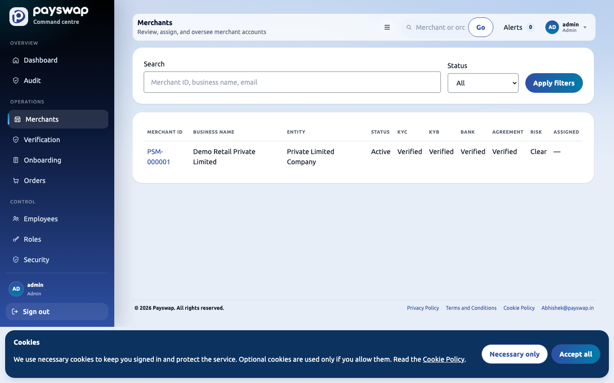

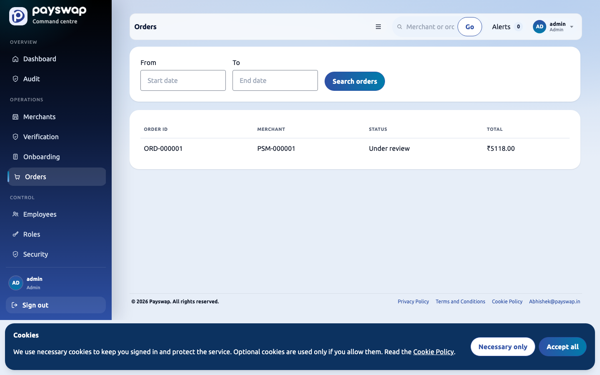

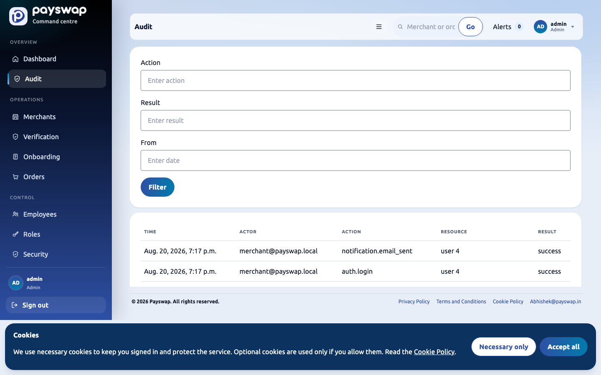

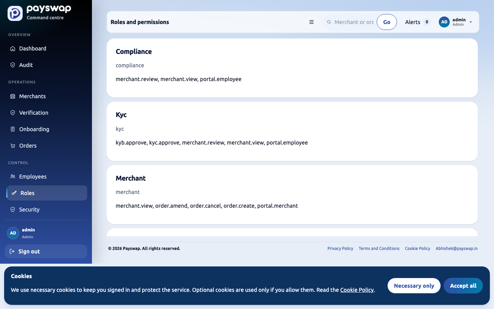

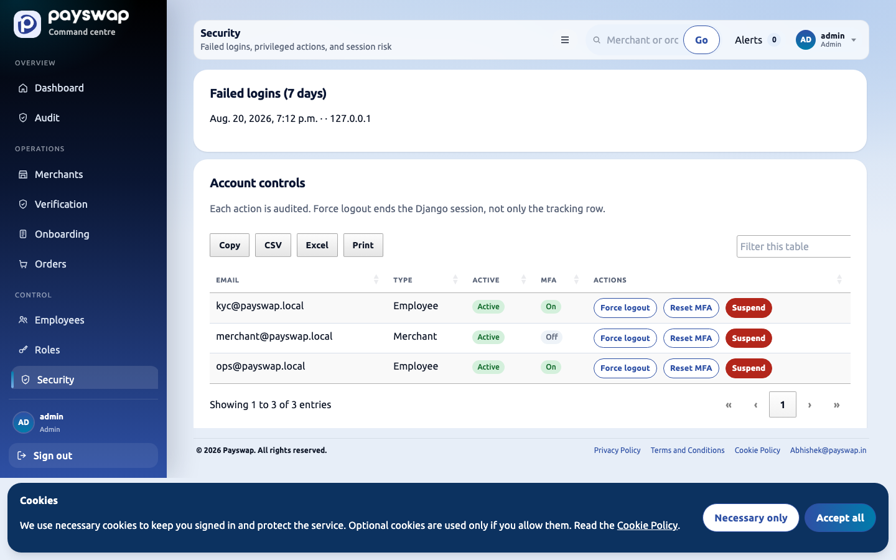

| Area | Path | Purpose |
|------|------|---------|
| Dashboard | `/administration/` | KPI cards |
| Merchants | `/administration/merchants/` | Profiles, tabs, document review |
| Verification | `/administration/verification/` | Provider records |
| Onboarding | `/administration/onboarding/` | Application queue |
| Orders | `/administration/orders/` | All POs |
| Employees / Roles | `/administration/employees/`, `/roles/` | Grant/revoke |
| Audit / Security | `/administration/audit/`, `/security/` | Forensics, lockouts, privileged actions |

---

## 9. Notifications & audit

**Email (and OTP SMS)** for kept flows: verification codes, password reset, onboarding clarification, application approved/rejected, document rejected, agreement ready/executed/eSign failed, order submitted/approved/rejected/changes/cancelled.

**Audit** (`audit.AuditEvent`): every meaningful action (login, onboarding transitions, document review, agreement events, order transitions, PO PDF download) with request id / IP / redacted payloads.

**Webhooks:** `POST /webhooks/cashfree/` handles `E_SIGN_*` and `DIGILOCKER_*` only; durable dedupe via `audit.WebhookEvent`.

---

## 10. How to recreate demo screenshots locally

```bash
# Server running on :8000, DB migrated and seeded
python manage.py seed_payswaphub
python manage.py bootstrap_local --password 'CorrectHorse9!'
PYTHONPATH=. python scripts/seed_docs_demo.py
PYTHONPATH=. python scripts/capture_role_flow_screenshots.py
```

Outputs land in `docs/guides/screenshots/`.

---

## 11. Quick reference — status vocabularies

**Onboarding application:** `DRAFT` → `SUBMITTED` → `UNDER_REVIEW` → `APPROVED` / `REJECTED` / `CLARIFICATION_REQUIRED`

**Merchant flags:** `kyc_status`, `kyb_status`, `bank_status`, `agreement_status`, `commercial_status`, overall `status`

**Agreement:** `GENERATED` → `MERCHANT_REVIEW` → `MERCHANT_SIGNED` → `COUNTERSIGNED` → `EXECUTED` (also `SIGNING_FAILED`, `EXPIRED`, `CANCELLED`)

**Purchase order:** `DRAFT` → `SUBMITTED` → `UNDER_REVIEW` → **`APPROVED`** (also `CHANGES_REQUESTED`, `REJECTED`, `CANCELLED`)

---

*Last updated: August 2026 — aligned with the onboarding / KYC / agreement / PO deep-clean.*
